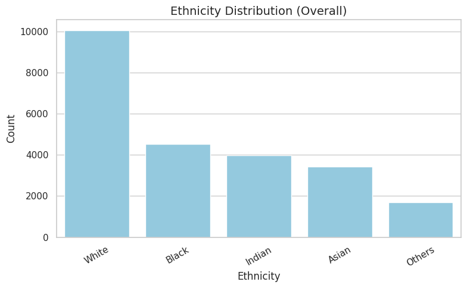
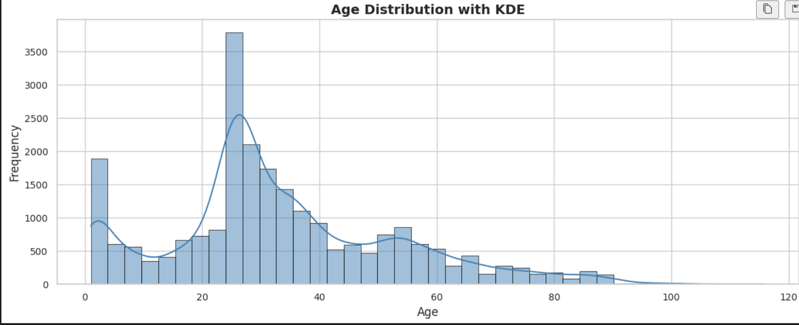

# UTKFace Age, Gender, and Race Classification

## Overview
This project trains a deep learning model to predict age from facial images using the UTKFace dataset. It includes preprocessing, normalization, CNN training, and evaluation.

## Dataset
Facial images labeled with:
- **Age**: 0–116  
- **Gender**: 0 (Male), 1 (Female)  
- **Race**: 0 (White), 1 (Black), 2 (Asian), 3 (Indian), 4 (Others)  

[UTKFace Dataset on Kaggle](https://www.kaggle.com/datasets/jangedoo/utkface-new)

## Workflow

### 1. Preprocessing  
- Extracts age, gender, race from filenames  
- Filters races and saves `Images.csv`

### 2. Image Processing  
- Resizes to 168x168, normalizes pixel values

### 3. Training  
- CNN built with TensorFlow/Keras  
- Optimized using Adam and MSE

### 4. Evaluation & Inference  
- Evaluates on test set  
- Predicts on new images (e.g., `Sharif.png`)

## Requirements
```bash
pip install numpy pandas matplotlib tensorflow pillow scikit-learn opencv-python
```

## Running the Project
1. Place the `UTKFace` dataset in the working directory  
2. Run the script to preprocess, train, and evaluate  
3. Test the model on new images

## Output
- `Images.csv` with processed data  
- Trained model and evaluation metrics  
- Dataset and prediction visualizations

## Visualizations
  
  
  
  
  
  
  

## Author
Sharif
