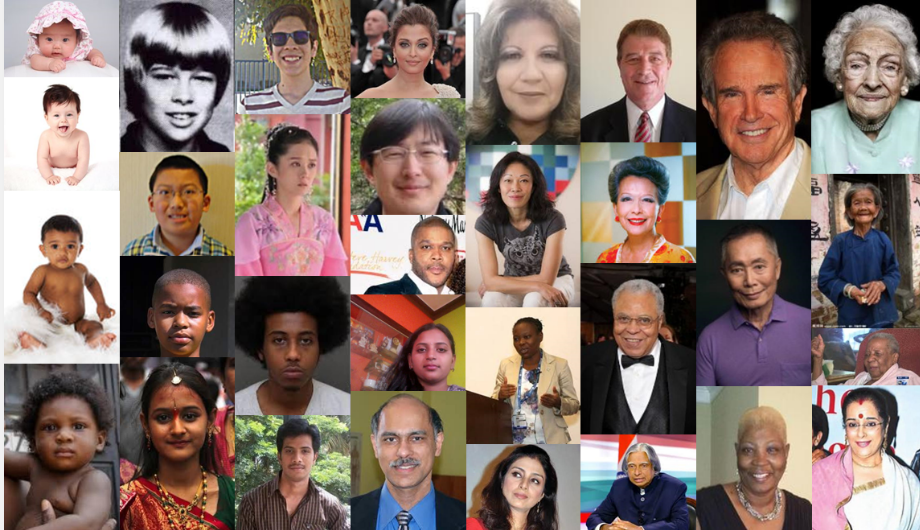
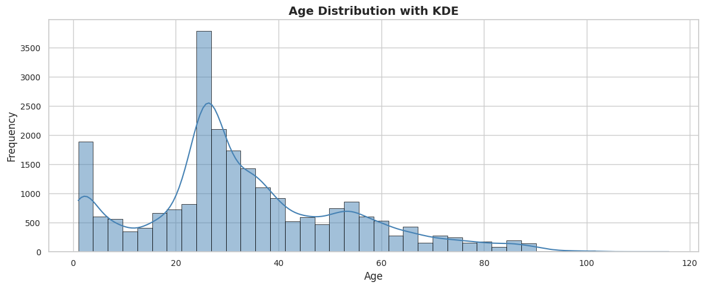
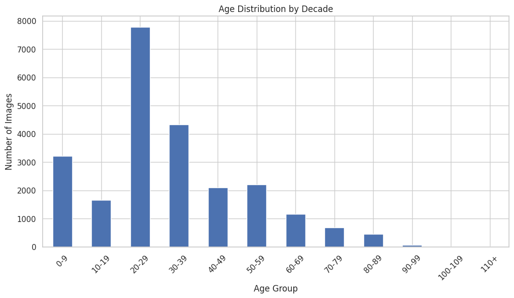
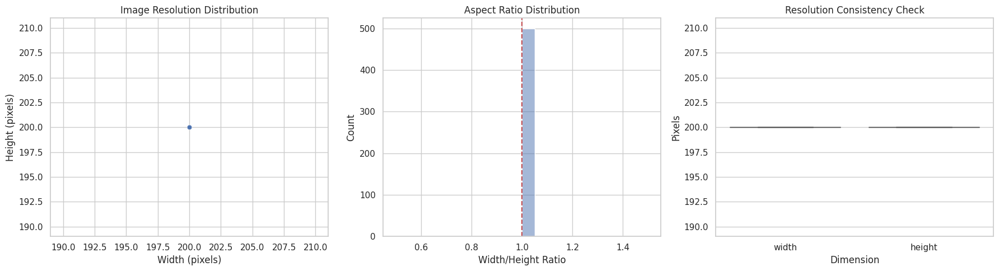
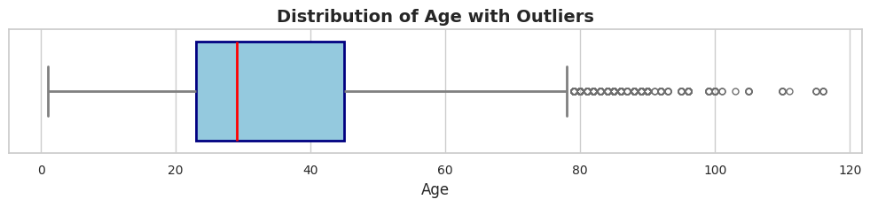
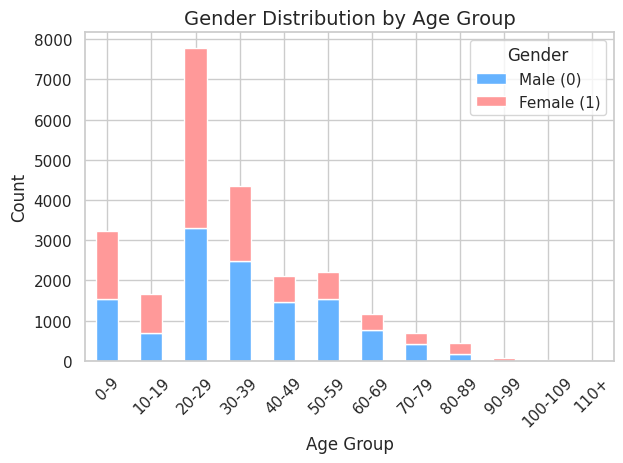

# UTKFace Age, Gender, and Race Classification

## Overview
This project trains a deep learning model to predict age, gender, and race from facial image.

## Dataset [UTKFace Dataset on Kaggle](https://www.kaggle.com/datasets/jangedoo/utkface-new)

## Samples of the data
-  

Facial images are labeled with:
- **Age**: 0–116
- **Gender**: 0 (Male), 1 (Female)  
- **Race**: 0 (White), 1 (Black), 2 (Asian), 3 (Indian), 4 (Others)  

## EDA Example Age Distribution
-  
## Workflow

### 1. Preprocessing  
- Extracts age, gender, and race from filenames  
- Filters unwanted race categories and saves the cleaned dataset to `Images.csv`  



### 2. Image Processing  
- Resizes images to 168x168 pixels  
- Normalizes pixel values to the [0,1] range  



### 3. Model Training  
- Uses a CNN built with TensorFlow/Keras  
- Includes Conv2D, MaxPooling, Dense, and Dropout layers  
- Optimized using Adam and mean squared error (MSE) loss  

### 4. Evaluation & Inference  
- Evaluates model performance on a test split  
- Predicts age on new images (e.g., `Sharif.png`)  

  


## Requirements
```bash
pip install numpy pandas matplotlib tensorflow pillow scikit-learn opencv-python
```

## Running the Project
1. Place the `UTKFace` dataset in the working directory  
2. Run the script to preprocess, train, and evaluate  
3. Use the trained model for inference

## Output
- `Images.csv` with processed data  
- Trained model with evaluation metrics  
- Data distribution and prediction insights throughout this README

  
## Author
Sharif
